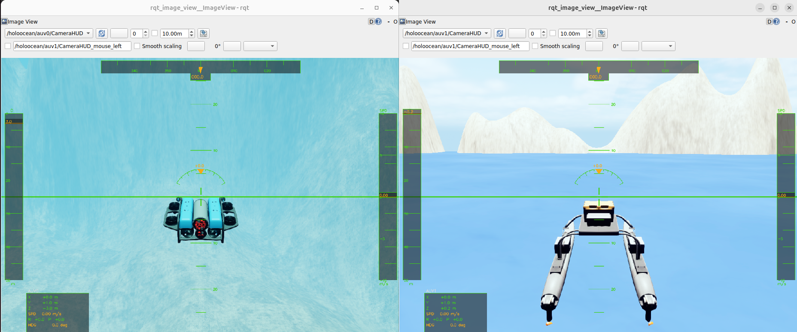
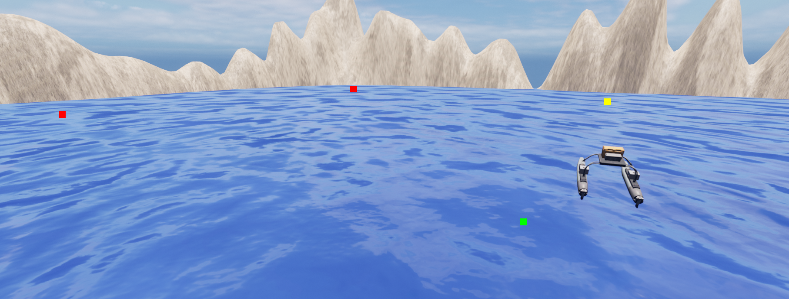

# HoloOcean ROS 2 Interface


ROS 2 integration for [HoloOcean](https://github.com/byu-holoocean/HoloOcean), a high-fidelity marine robotics simulator. This package bridges the HoloOcean Python API to the ROS 2 network, exposing sensor data as topics and accepting control commands via subscriptions and services.

## HoloOcean ROS (0.1) New Features
 - Improved joystick example
 - Multi-agent joystick exaple
 - Simplified agent commands
 - Sensor rotation commands
 - Minor bug fixes and Docker improvements


## Packages

| Package | Description |
|---|---|
| `holoocean_main` | Core simulation node; loads a scenario and ticks the environment |
| `holoocean_interfaces` | Custom ROS 2 message and service definitions |
| `holoocean_examples` | Example nodes: joystick control, waypoint following, depth/heading commands |

## Prerequisites

- ROS 2 (tested on Humble and Jazzy)
- HoloOcean Python package — [source](https://github.com/byu-holoocean/HoloOcean) / [docs](https://byu-holoocean.github.io/holoocean-docs/)

> **Note:** Avoid virtual environments (e.g. Conda) for ROS 2 and HoloOcean; they can cause runtime and dependency issues.

## Installation

### Docker (recommended)

See [docker/README.md](docker/README.md) for setup instructions. Both [development](docker/dev/README.md) and [runtime](docker/runtime/README.md) configurations are available.

### From source
After installing HoloOcean, clone this repository into your ROS 2 workspace:
```bash
cd ros2_ws/src
git clone https://github.com/byu-holoocean/holoocean-ros.git
cd ..
source /opt/ros/humble/setup.bash
colcon build
source install/setup.bash
```

## Quick Start

```bash
ros2 launch holoocean_main holoocean_launch.py
```

## Examples

### Joystick control

Control agents in HoloOcean with a joystick using the `joy_linux` package.

```bash
ros2 launch holoocean_examples joy_launch.py
```

See [holoocean_examples/README.md](holoocean_examples/README.md) for full setup instructions, button mapping, and config reference.



### Waypoint following

Control a surface vessel with a list of defined waypoints.

```bash
ros2 launch holoocean_examples waypoint_launch.py
```



### Depth/heading/speed commands

Send depth, heading, and speed commands to a torpedo AUV using the Fossen controller.

```bash
ros2 launch holoocean_examples command_launch.py
```

## Node Reference: `holoocean_node`

Loads a scenario JSON file, starts the HoloOcean environment, and ticks it in a background thread.

### Subscribed Topics

| Topic | Type | Description |
|---|---|---|
| `command/agent` | `AgentCommand` | Thruster/actuator commands for non-Fossen agents |
| `command/sensor` | `SensorCommand` | Sensor configuration commands (e.g. camera rotation) |
| `depth` | `DesiredCommand` | Depth setpoint for autopilot mode |
| `heading` | `DesiredCommand` | Heading setpoint for autopilot mode |
| `speed` | `DesiredCommand` | Speed setpoint for autopilot mode |
| `debug/points` | `visualization_msgs/Marker` | Debug points to draw in the simulation |

### Published Topics

| Topic | Type | Description |
|---|---|---|
| `<agent>/<SensorName>` | varies | Sensor data for each agent (see below) |
| `/clock` | `rosgraph_msgs/Clock` | Simulation time |

Sensor topic names follow the pattern `<agent_name>/<sensor_name>`. If no name is set for a sensor in the scenario file, it defaults to the sensor type name.

### Services

| Service | Type | Description |
|---|---|---|
| `reset` | `std_srvs/Trigger` | Reset the simulation environment |
| `control_mode` | `SetControlMode` | Change an agent's control mode |

### Parameters

| Parameter | Type | Default | Description |
|---|---|---|---|
| `scenario_path` | string | `""` | Path to the scenario JSON file |
| `relative_path` | bool | `true` | Resolve `scenario_path` relative to the package share directory |
| `show_viewport` | bool | `true` | Show the Unreal Engine viewport window |
| `draw_arrow` | bool | `true` | Draw a heading arrow for each Fossen agent in the simulation |
| `render_quality` | int | `-1` | Render quality: 0 = low, 1 = normal, 2 = high. -1 = default |
| `publish_commands` | bool | `true` | Publish computed control surface commands back to ROS |

## Recording Sensor Data

```bash
ros2 bag record /holoocean/auv0/RotationSensor /holoocean/auv0/LocationSensor
```

See the [ROS 2 bag documentation](https://docs.ros.org/en/humble/Tutorials/Beginner-CLI-Tools/Recording-And-Playing-Back-Data/Recording-And-Playing-Back-Data.html) for more information.

## Notes

- Simulation time may run faster or slower than wall time. Use the `/clock` topic to [synchronize nodes](https://design.ros2.org/articles/clock_and_time.html) with sim time.

## Resources

- [HoloOcean repository](https://github.com/byu-holoocean/HoloOcean)
- [HoloOcean documentation](https://byu-holoocean.github.io/holoocean-docs/)
- [ROS 2 documentation](https://docs.ros.org/en/humble/index.html)

## Citation

If you use this package or HoloOcean in your research, please cite the relevant works. For this ROS interface:

```bibtex
@inproceedings{meyers2025testing,
  title={Testing and Evaluation of Underwater Vehicle Using Hardware-in-the-Loop Simulation with HoloOcean},
  author={Meyers, Braden and Mangelson, Joshua G},
  booktitle={OCEANS 2025-Great Lakes},
  pages={1--8},
  year={2025},
  organization={IEEE}
}
```

For other HoloOcean works, see the [HoloOcean repository](https://github.com/byu-holoocean/HoloOcean) and [documentation](https://byu-holoocean.github.io/holoocean-docs/) for the full list of publications to cite.

---

Developed by the [FRoStLab (Field Robotic Systems Lab)](https://frostlab.byu.edu/) at Brigham Young University.
